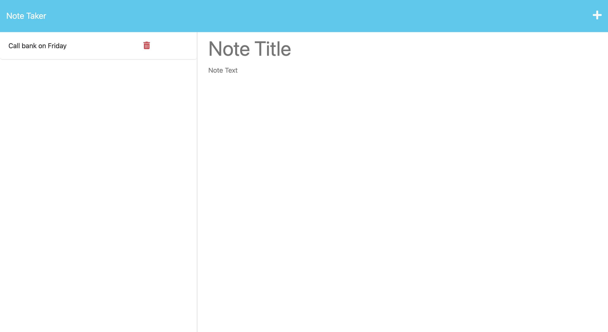
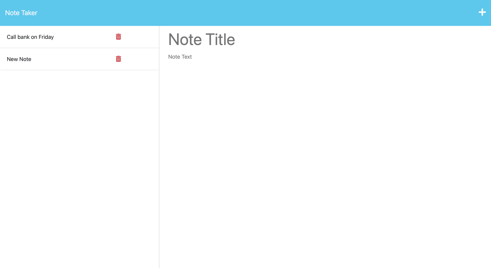

# Note Taker

## Description

This webapp allows users to save and retreive notes. It usees an Express.js back-end to save and retrieve note data from a JSON file.

## Installation

N/A

## Usage

To use this webapp, click on the "Get Started" button. On the new page, click on the "+" icon on the top right corner of the webpage. Enter the note title and the body of the note in "Note Title" and "Note Text", respectively. Click on the save icon that appears on the right side of the "+" icon to save a note. Saved notes can be seen on the left side of the webpage.
To view notes, click on the saved note on the left side of the webpage. The corresponding note will be displayed on the right side of the webpage.
The following images shows the web application's appearance and functionality:

Start Page

Webpage after clicking "Get Started"

Webpage when a new note is being created

Webpage after new note is saved

Webpage when viewing saved note

## Credits

N/A

## License

N/A

## Tests

Here is the link to the webpage:
[Note Taker](https://wdverse.github.io/Note-taker/)